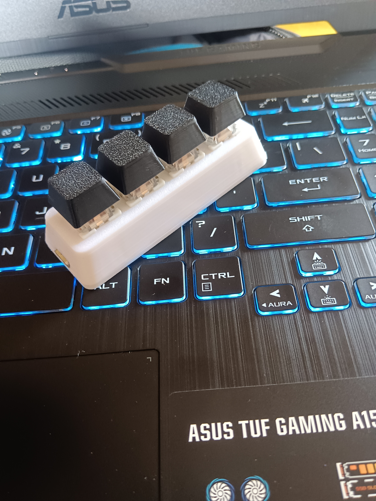
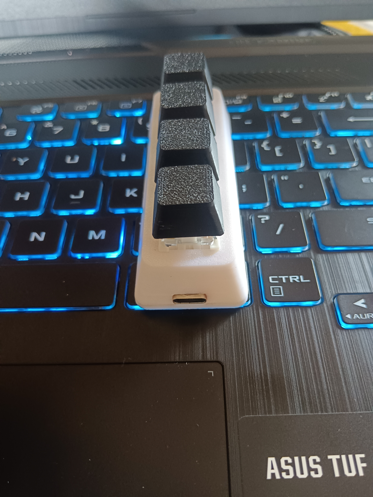

  

# 🚀 Picopad v1

Picopad v1 is a custom **4-key macropad** built using the **Raspberry Pi Pico**.  
It supports multi-layer keymaps, macros, Windows shortcuts, URL launching, and application execution — all configurable through a **custom web-based configurator**.

The device features a **single-key layer cycle system**, **Outemu mechanical switches**, and a compact **3D-printed case** with **USB-C** input.

---

## 🌐 Picopad Configurator

Picopad v1 uses **Picopad Config**, a web-based configuration tool that provides the **same core functionality as POG**, while being tailored specifically for Picopad v1.

✨ What you can do:

- 🎛️ Configure key mappings & pin layout  
- 🧱 Create and manage multiple layers  
- ⌨️ Assign macros and shortcuts  
- 🪟 Use pre-listed **Windows shortcuts**  
- 🌍 Launch websites by pasting URLs  
- 📂 Launch applications using Windows **Run commands**  
- 🧩 Generate KMK firmware  
- ⚡ **Flash firmware directly to the Raspberry Pi Pico**  
- 🧠 Configure everything visually — no manual Python editing  

🔗 **Picopad Configurator:**  
👉 https://picopad-config.web.app/

---

## 🔌 Pin Mapping (Raspberry Pi Pico)

Picopad v1 uses four GPIO pins for its switches:

| 🔘 Key | 🧩 Pico GPIO |
|------|-------------|
| Key 1 | GPIO 6 |
| Key 2 | GPIO 7 |
| Key 3 | GPIO 8 |
| Key 4 | GPIO 9 |

All switches share a common **GND** connection.

### 🧵 Wiring Diagram (Simple)

GPIO 6 ──┐
GPIO 7 ──┤── switches → GND
GPIO 8 ──┤
GPIO 9 ──┘

---

## 🔌 USB-C Wiring (Manual Soldering)

USB-C connector is wired to the Pico test pads:

| USB-C Pad | Pico Pad |
|-----------|----------|
| D+ | TP1 |
| D– | TP2 |
| Shield / Ground | TP3 |
| 5V | Pin 40 (VBUS) |

This allows direct USB-C input even when the Pico's original micro-USB port is not used.

---

## 🎛 Layers

Picopad v1 supports **3 layers**, controlled by one layer-cycle key.

The layer key cycles:

Layer 0 → Layer 1 → Layer 2 → back to Layer 0

This is implemented in POG using layer switching actions (`TO(1)`, `TO(2)`, `TO(0)`).

---

## 📂 Folder Structure

picopad_v1/
├── firmware/
│ ├── code.py
│ ├── keymap.py
│ ├── settings.toml
│ ├── pog.json
│ └── kmk/ (KMK firmware library)
├── images/ (device pictures)
└── README.md

---

## 📸 Images

### Top View

### USB-C Side View

---

## 🛠 Hardware Features

- **Raspberry Pi Pico** microcontroller  
- **4× Outemu mechanical switches** (plate-mounted)  
- **USB-C port** soldered directly to test pads (TP1, TP2, TP3, Pin 40)  
- **3D-printed custom case** for compact and clean layout  
- **KMK firmware** generated via picopad-config 
- **Single key layer-cycle system** (Layer 0 → 1 → 2 → 0)

---
